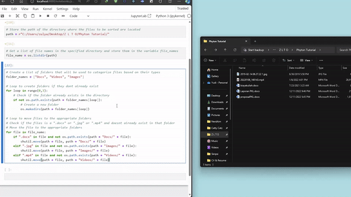

This script automates the organization of files within a specified directory by sorting them into folders based on their file types. It creates folders for documents, images, and videos, then moves files into their respective folders. This is particularly useful for keeping your workspace organized and managing large volumes of files.

## DEMO

